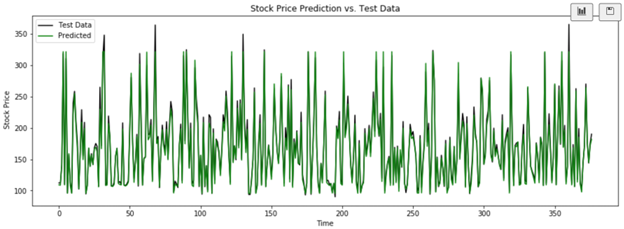

# ML-StockPricePrediction

## Stock Price Prediction Using Recurrent Neural Networks
This repository contains code to create a Recurrent Neural Network (RNN) model to predict the next day's opening price of a stock using the past 3 days' Open, High, Low prices, and volume as features.

### Dataset and Data Preparation
The dataset provided is for stock price prediction for 5 years, with one sample per day. The data is available in the file q2_dataset.py. I used the latest 3 days' data as features and the next day's opening price as the target for training the RNN.

### Architecture
Various network models were explored and systematically evaluated, drawing upon a comprehensive review of research to gain valuable insights and inform the selection process. After careful consideration, the present model emerged as the most suitable choice owing to its accuracy.
The ultimate architecture consists of four layers of Long Short-Term Memory (LSTM) units, augmented with dropout layers to enhance regularization. The model culminates with a dense layer for prediction. The training process spanned 600 epochs, employing a batch size of 32, and was optimized using the highly effective Adam optimizer.

### Results

